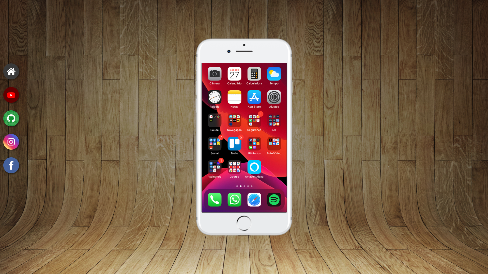

<h1 align="center"> Projeto Social </h1>

Projeto criando durante o curso de HTML e CSS para testar meus conhecimentos com Media Queries 
<a href="https://www.cursoemvideo.com/">Estude esse projeto em formato de vídeo clicando aqui.</a>

  <a href="#-tecnologias">Tecnologias</a>&nbsp;&nbsp;&nbsp;|&nbsp;&nbsp;&nbsp;
  <a href="#-projeto">Projeto</a>&nbsp;&nbsp;&nbsp;|&nbsp;&nbsp;&nbsp;
  <a href="#memo-licença">Licença</a>

  

 

  

## 🚀 Tecnologias

Esse projeto foi desenvolvido com as seguintes tecnologias:

- HTML e CSS
- Git e Github

## 💻 Projeto

O Projeto Social é um teste de conhecimento sobre Media Query.

- [Acesse o projeto finalizado, online](https://weslleyrichardi.github.io/projeto-social/)

Esse projeto está sob a licença MIT.
